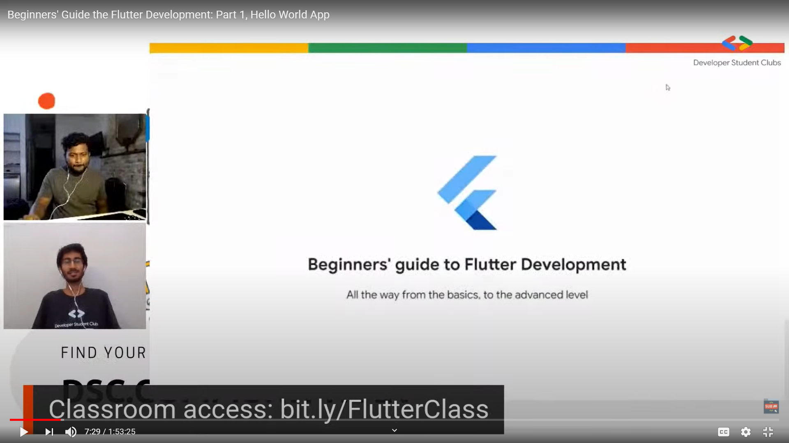
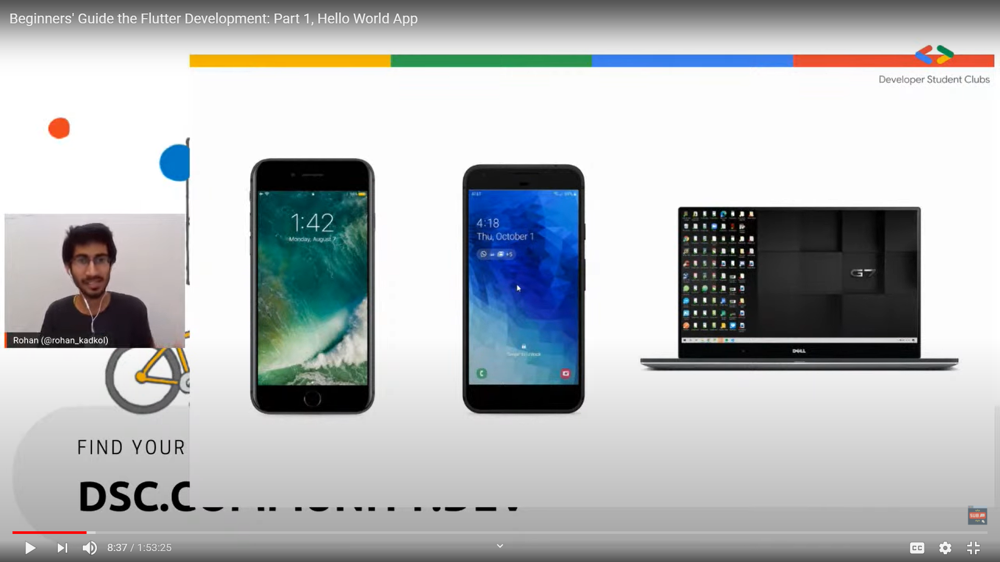
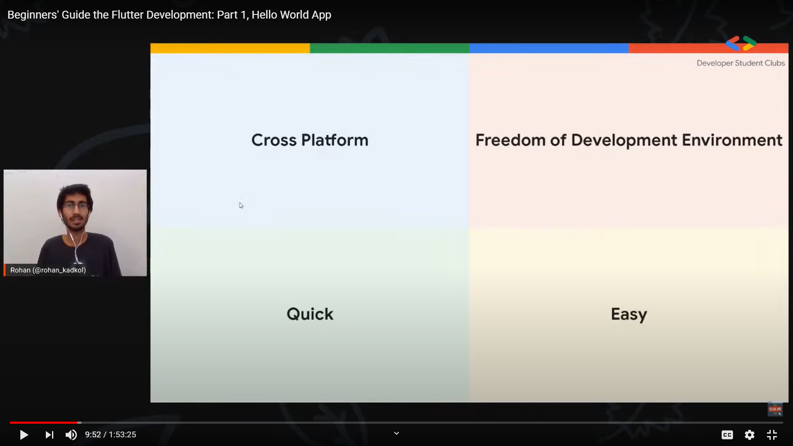
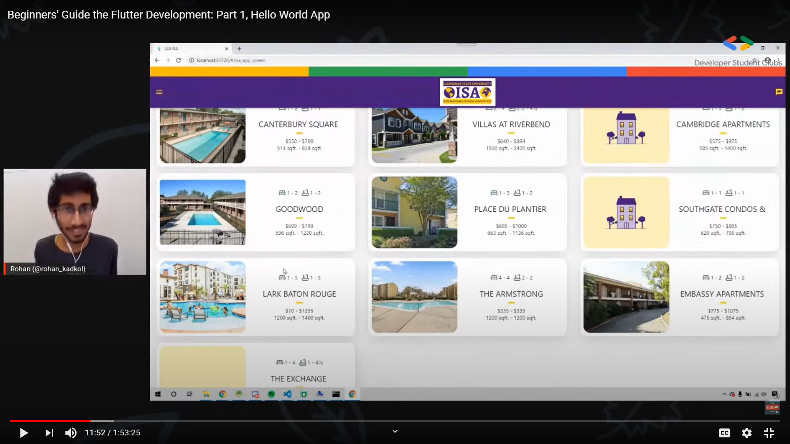

# What is Flutter?

This is the presentation I used in the first session of Beginners' Guide to Flutter Development.

[See the full video on YouTube](https://youtu.be/tVq_FjrFfjs)

## Screenshots

